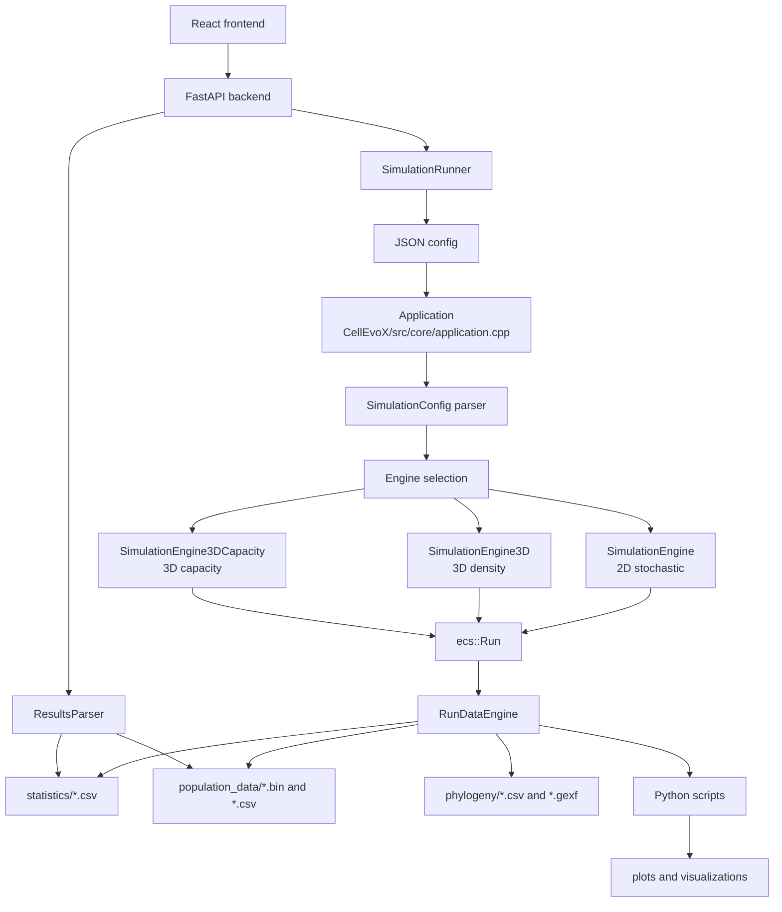

# Architecture

CellEvoX is a C++ simulation core with Python post-processing and a web control
surface. The runtime model is easiest to understand as a pipeline: config in,
engine run, snapshots/statistics out, analysis and visualization on top.

## System map

## C++ core

The active CMake project is `CellEvoX/CMakeLists.txt`.

Key targets:

- `CellEvoXTests`: always built by the test path, including with `SKIP_GUI=ON`.
- `CellEvoX`: runnable CLI/GUI-linked executable, built only when GUI dependencies
  are enabled.

The CLI entry point is `CellEvoX/src/main.cpp`, which parses command-line options
and constructs `CellEvoX::core::Application`.

`Application` has two runtime modes:

- `--config /path/to/config.json`: parse config, select engine, run simulation,
  then export and visualize output.
- `--analyze /path/to/run_dir`: read an existing run directory and re-run analysis
  and visualization steps.

## Engine selection

`SimulationConfig` stores `sim_type`, and `Application` selects the engine:

| Config mode | C++ enum | Engine |
| --- | --- | --- |
| `stochastic` | `STOCHASTIC_TAU_LEAP` | `SimulationEngine` |
| `deterministic` | `DETERMINISTIC_RK4` | Parsed, but not dispatched to an RK4 implementation in current mainline |
| `spatial_3d_density` | `SPATIAL_3D_DENSITY` | `SimulationEngine3D` |
| `spatial_3d_capacity` | `SPATIAL_3D_CAPACITY` | `SimulationEngine3DCapacity` |
| `spatial_3d` | `SPATIAL_3D_DENSITY` | Legacy alias |

`SimulationEngine3DCapacity` intentionally reuses `CommonPopulationStep` so its
birth/death/mutation events match the 2D stochastic engine before spatial
placement and mechanics are applied.

## Data ownership

The core cell state is a `tbb::concurrent_hash_map<uint32_t, Cell>` named
`CellMap`. Dead-cell ancestry is stored in `Graveyard`, another
`tbb::concurrent_hash_map`.

`ecs::Run` receives the final live cells, graveyard, mutation map, statistics,
population snapshots, total deaths, and final tau. Its constructor derives
summary and phylogeny structures used by exports.

## Output pipeline

`RunDataEngine` prepares a timestamped output directory below `output_path`, then
exports:

- generational statistics CSV,
- population snapshots and optional CSV companions,
- phylogenetic CSV/GEXF files,
- static plots,
- Muller diagrams,
- clone phylogeny/count/lifespan charts,
- 2D clone-growth animation,
- 3D tumor replay.

Some plots are generated directly in C++ through `matplotlibcpp`; others are
delegated to Python scripts in `CellEvoX/scripts`.

## Web layer

The web app is a local control and results surface:

- `web/backend/main.py`: FastAPI API, schema endpoint, simulation control,
  WebSocket log stream, results endpoints.
- `web/backend/runner.py`: writes atomic launch configs, finds the C++ binary,
  starts subprocesses, streams logs, and supports sequential batch runs.
- `web/backend/results_parser.py`: scans run directories, reads configs, stats,
  population CSV, and prepares Muller data for the frontend.
- `web/frontend`: React/Vite UI for configuration, running, and results.

The backend does not deeply validate posted configs. It accepts a `dict`; the C++
parser is the final validation layer for required fields.

## Dependency direction

Keep these directions clean:

- C++ core should not depend on web code.
- Python scripts may mirror output formats, but the binary snapshot contract is
  defined in C++ and mirrored by `snapshot_io.py`.
- Web backend can run the binary and parse outputs, but should not invent config
  semantics that C++ does not accept.
- Frontend defaults/types should match backend schema and C++ parser behavior.

## Known architectural caveats

- `deterministic` is exposed in UI/backend schema and parsed by C++, but current
  mainline engine dispatch does not execute RK4.
- Native Windows builds are fragile because some C++ code reads `/proc/self/statm`
  and includes `unistd.h`.
- `RunDataEngine` mixes path resolution, C++ plotting, Python scripts, and shell
  command construction. Treat output-pipeline edits as integration-sensitive.
- The QML UI files are present, but the current tested production path is CLI plus
  web, not the QML app.
